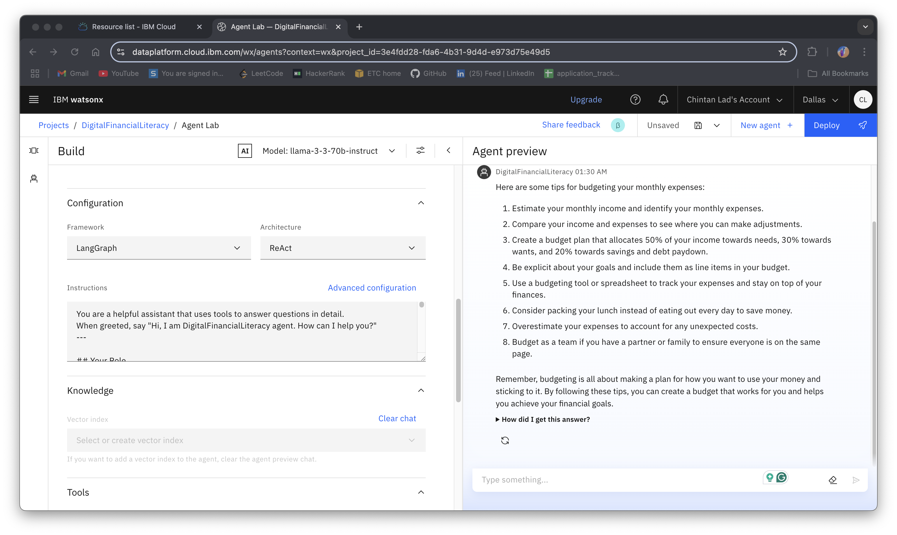
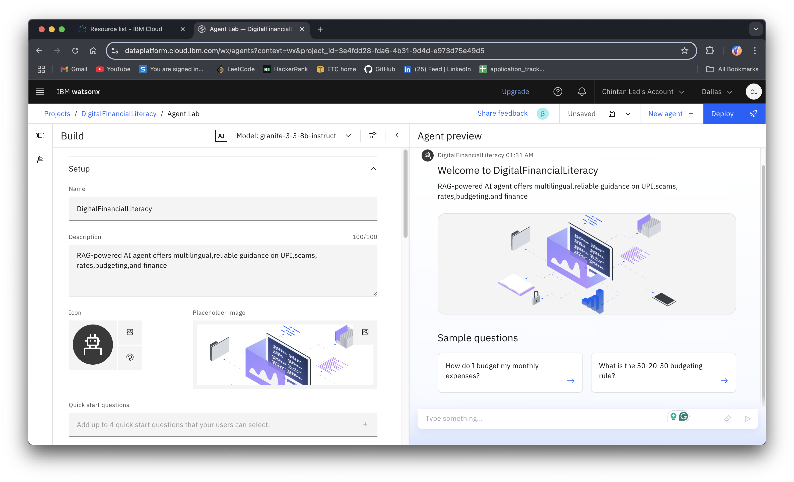
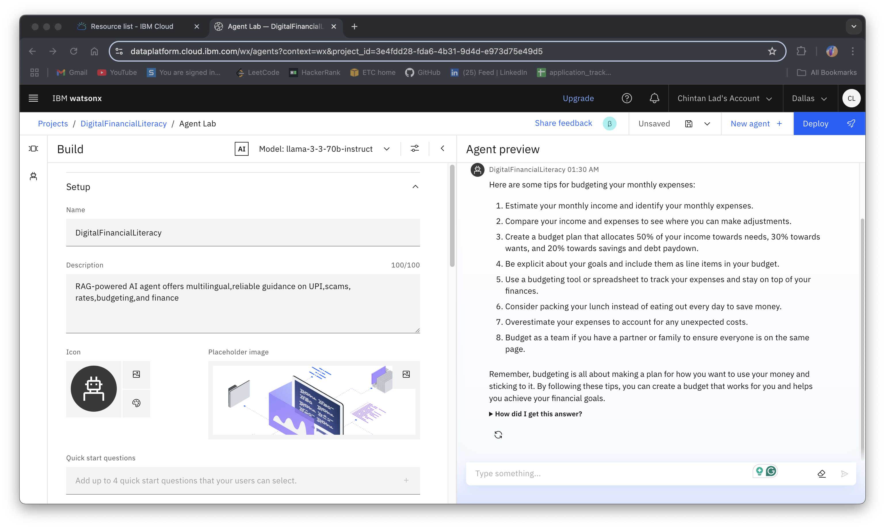
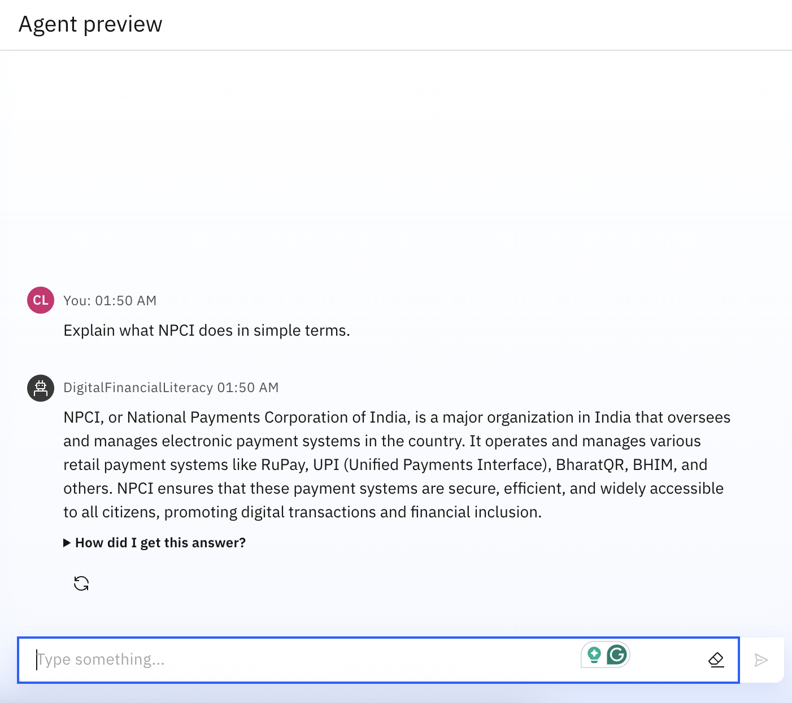
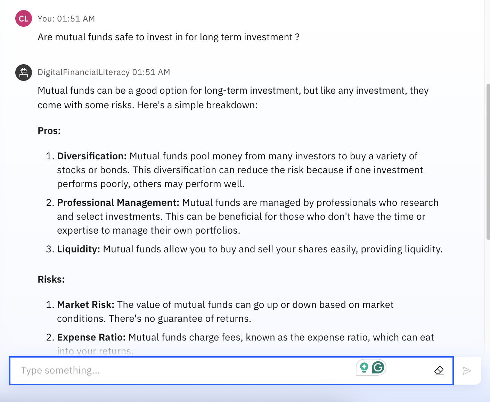
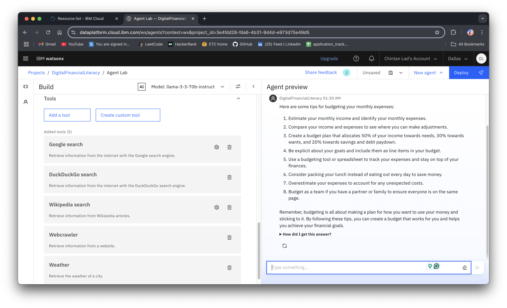

# Digital Financial Literacy AI Agent

## Problem Statement

An AI Agent for Digital Financial Literacy, powered by RAG (Retrieval-Augmented Generation), helps users understand and navigate essential financial tools and practices. It retrieves reliable content on using UPI, avoiding online scams, understanding interest rates, budgeting, and personal finance management from government portals, banking websites, and educational platforms. With multilingual support, users from diverse backgrounds can interact in their preferred language and ask questions like "How do I send money via UPI?" or "What is a safe interest rate for a loan?" The agent ensures financial literacy is accessible, personalized, and culturally inclusive. This AI-driven assistant empowers users with knowledge, protects them from fraud, and builds confidence in digital finance.

## Technology Stack

- **IBM Cloud Lite services** - For hosting and deployment
- **IBM Granite** - Foundation model for natural language processing
- **RAG (Retrieval-Augmented Generation)** - For retrieving and generating accurate financial information

## Implementation Guide

### 1. Log In and Create a Watsonx.ai Project

- Log in to IBM Cloud console with your IBMid
- From the Catalog, search for watsonx.ai Studio and click Create
- Name your project (e.g., Digital Finance Agent)
- Add the following services:
  - Watsonx.ai Runtime (for foundation-model inferencing)
  - Watson Machine Learning (for deploying API endpoints)
  - Cloud Object Storage (for storing PDFs & notebooks)
- Click Finish to open your project in watsonx.ai Studio


*This image shows the configuration setup for the watsonx.ai project with all required services.*

### 2. Open Prompt Lab

- In your project's Assets panel, click New asset → Chat and build prompts with foundation models
- Name it Financial Literacy Prompt Lab and choose a foundation model (e.g., IBM Granite LLM)
- Click Create to launch the Prompt Lab interface


*This image displays the IBM Granite model selection interface for the prompt lab.*

### 3. Create a Vector Index and Ingest Your Document

- In the left sidebar, select Grounding with documents
- Click Select or create vector index → Create new index
- Enter Index name: financial-literacy
- Under Add documents, click Upload and choose Financial_Literacy_Content.pdf from your local machine
- Wait for "Extraction complete" (text is vectorized and stored)


*This image shows the setup process for creating the vector index and uploading the financial literacy content.*

### 4. Author Your RAG-Powered Chat Flow

- Switch to Chat mode at the top navigation of Prompt Lab
- In the System prompt editor, paste the high-level instructions (project description, goals, wow factors)
- In the User prompt box, enter a sample query, e.g.: "How can I avoid UPI fraud?"
- Click Submit. Prompt Lab will:
  - Retrieve the top 3 passages from your financial-literacy index
  - Concatenate them with your system prompt
  - Send the combined prompt to the foundation model
  - Display a response citing the source pages

### 5. Iterate and Refine

- Adjust your System prompt to improve tone, detail level, or multilingual support
- Test other quick-start questions (e.g., "What is the interest rate on a personal loan?")
- Confirm that responses are grounded in your PDF and cite sources correctly


*This image shows a sample output from the AI agent responding to a user query about financial literacy.*


*This image displays another example of the AI agent's response to a different financial query.*

### 6. Save Your Work as a Deployment Notebook

- Once satisfied, click Save → Download deployment notebook
- This auto-generated Jupyter notebook contains:
  - SDK and authentication setup
  - Code to query your vector index
  - Code to call the foundation model
- Alternatively, click Save → Save as asset to keep it within IBM Cloud


*This is the Jupyter notebook containing the deployment code for the Digital Financial Advisor.*

### 7. Execute & Test in the Cloud Notebook

- In watsonx.ai Studio's Assets, open your saved notebook asset
- Run each cell sequentially:
  - Authenticate using your project's API key
  - Instantiate the Vector Index SDK
  - Load your index and test ask_agent(question) function
- Verify sample queries produce the same responses as in Prompt Lab

### 8. Deploy as a Managed AI Service

- In your notebook, locate the deployment section
- Run the cell that calls watsonx.ai or Watson Machine Learning deployment API
- A REST endpoint URL and API key will be returned
- You can now integrate this endpoint into any front-end (web page, mobile app, Streamlit) without local servers

### 9. (Optional) Build a Simple Front-End in IBM Cloud Shell

- In IBM Cloud console, open Cloud Shell
- Create a Flask or Node.js app folder:
  ```bash
  mkdir finance-agent && cd finance-agent
  ```
- Write a minimal server (app.py or index.js) that:
  - Reads user input
  - Calls your deployed REST endpoint
  - Returns the JSON response
- Deploy via IBM Cloud Foundry or Code Engine directly from Cloud Shell


*This image shows all the tools and services used in the development of the Digital Financial Advisor.*

### 10. Monitor and Manage

- In Watson Machine Learning → Deployments, view usage metrics, logs, and scale settings
- In Prompt Lab → Fact Sheets, review your agent's provenance and audit trail
- Update content by uploading new PDFs to your vector index; no code changes required

## Key Features

- **RAG-powered responses**: Accurate information retrieved from trusted financial sources
- **Multilingual support**: Interact in your preferred language
- **Document grounding**: All responses are based on verified financial literacy content
- **Cloud-native deployment**: No local CLI or external notebook service required
- **Easy content updates**: Simply upload new PDFs to refresh knowledge base

## Conclusion

By following these steps entirely within IBM Cloud's watsonx.ai Studio and Prompt Lab, you'll have a fully configured, document-grounded financial chatbot that helps users navigate the complex world of digital finance with confidence and security.